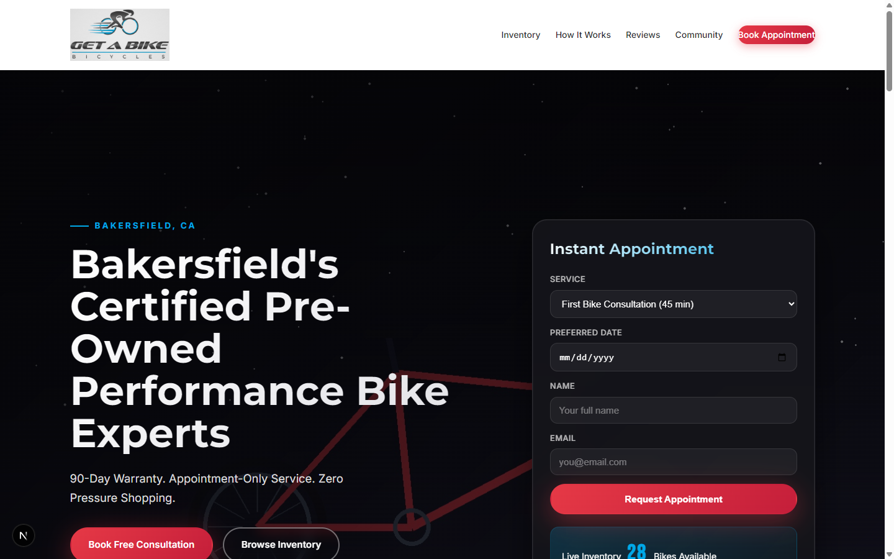

# Get A Bike Bakersfield - Luxury Edition 🚴‍♂️✨

> **Bakersfield's Premier Certified Pre-Owned Bicycle Dealership**

A luxury-grade website built for maximum local SEO dominance (GEO/AEO) and millionaire-level user experience.



## 🎯 Key Features

### 🏆 Premium Design
- **Black & Gold Luxury Theme** - Exudes exclusivity and premium quality
- **Glass Morphism Effects** - Modern, sophisticated UI elements
- **Cinematic Typography** - Cinzel (display) + Space Grotesk (body) font pairing
- **Smooth Animations** - Scroll-triggered reveals, hover effects, micro-interactions

### 📍 Local SEO Dominance (GEO/AEO)
- **Complete Schema.org Markup** - LocalBusiness, Product, Review, FAQ, Breadcrumb
- **Geographic Meta Tags** - Geo coordinates, ICBM, regional targeting
- **Sitemap.xml** - Properly structured for search engines
- **Robots.txt** - Optimized for Googlebot, Bingbot, DuckDuckBot
- **PWA Manifest** - Full Progressive Web App capabilities

### ⚡ Performance Optimized
- **Static Export** - Blazing fast load times
- **Image Optimization** - WebP/AVIF formats with lazy loading
- **Security Headers** - HSTS, CSP, X-Frame-Options
- **Caching Strategy** - Aggressive asset caching

### ♿ Accessibility
- **WCAG 2.1 AA Compliant** - Proper ARIA labels, focus states
- **Reduced Motion Support** - Respects user preferences
- **Semantic HTML** - Proper heading hierarchy, landmarks

## 🚀 Quick Start

```bash
# Install dependencies
npm install

# Development server
npm run dev

# Production build
npm run build

# Export static site
npm run export
```

## 📁 Project Structure

```
app/
├── page.js           # Main landing page with all sections
├── layout.js         # Root layout with fonts & metadata
└── globals.css       # Luxury styling system

public/
├── assets/           # Bike images, avatars, backgrounds
├── manifest.json     # PWA manifest
├── sitemap.xml       # SEO sitemap
├── robots.txt        # Crawler instructions
└── browserconfig.xml # Microsoft tile config
```

## 🎨 Design System

### Colors
```css
--color-black: #050505;        /* Primary background */
--color-gold: #c9a962;         /* Primary accent */
--color-gold-light: #e8d5a3;   /* Hover states */
--color-gray-100: #f5f5f5;     /* Light text */
--color-gray-500: #737373;     /* Muted text */
--color-gray-800: #262626;     /* Borders */
```

### Typography
- **Display**: Cinzel (400-700) - Headlines, luxury feel
- **Body**: Space Grotesk (300-700) - UI, readable
- **Accent**: Bebas Neue (400) - Numbers, stats

### Spacing
- Based on 4px grid system
- Generous whitespace for luxury feel
- Responsive scaling

## 🔍 SEO Optimizations

### Schema.org Structured Data
1. **LocalBusiness** - Complete business information
2. **Product** - All bike inventory with offers
3. **Review** - Customer testimonials with ratings
4. **FAQPage** - Common questions & answers
5. **BreadcrumbList** - Navigation structure

### Meta Tags
- Open Graph (Facebook, LinkedIn)
- Twitter Cards
- Dublin Core
- Geographic (geo.placename, ICBM)
- Apple Web App
- Microsoft Tiles

### Local SEO
- Target: Bakersfield, Kern County, CA
- Keywords: "luxury bikes", "certified pre-owned", "premium bicycles"
- Service area: Bakersfield, Delano, Oildale

## 🖼️ Image Generation Prompts

See `generate-luxury-images.md` for AI image generation prompts to create:
- Hero background
- Bike product shots
- Customer avatars
- Instagram gallery

## 📱 PWA Features

- Installable on iOS/Android
- Offline support capability
- Push notification ready
- Add to home screen
- Splash screens

## 🔧 Customization

### Update Business Info
Edit these files with your actual information:
- `app/layout.js` - Business name, address, phone
- `app/page.js` - Inventory, testimonials, events
- `public/manifest.json` - App details
- `public/sitemap.xml` - URLs

### Change Theme Colors
Edit CSS custom properties in `app/globals.css`:
```css
:root {
  --color-gold: #your-color;
  --color-black: #your-color;
}
```

## 📞 Contact Information

**Get A Bike Bicycles**
- 📍 213 E 18th St, Bakersfield, CA 93305
- 📞 (661) 555-0100
- ✉️ concierge@getabike.com
- 🌐 https://getabike.com

---

Built with ❤️ for cyclists who demand excellence.
